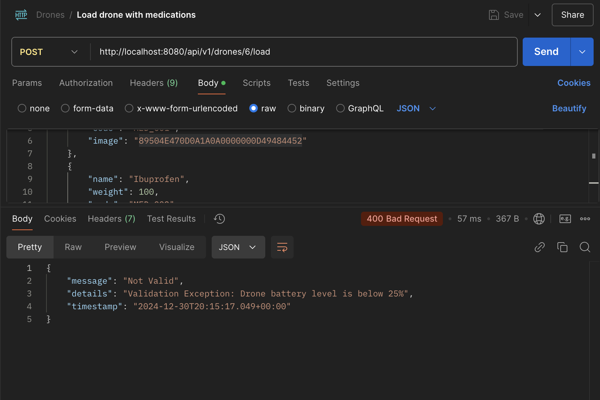

## Drones Management System
### Overview
This is a Spring Boot application designed to manage drones and their associated functionalities, such as:

- Registering drones
- Loading drones with medications
- Checking loaded medications
- Checking available drones for loading
- Checking drone battery levels

---

## Technologies Used
- Spring Boot: Backend framework
- Swagger/OpenAPI: API documentation
- Jakarta Validation: Input validation
- H2 Database: In-memory database for testing
- Lombok: To reduce boilerplate code

---
## Getting Started
### Prerequisites
    Java 17+
    Maven 3.6+
    (Optional) Docker for containerized deployment
## Clone the Repository
```bash
git clone https://github.com/LamaMohamed/drone-dispatch-backend.git
cd drone-dispatch-backend
```

## Build and Run the Application
### Build the project:
```bash
mvn clean install
```
### Run the application:
```bash
mvn spring-boot:run
```
The application will start on http://localhost:8080.

---
## API Endpoints

| HTTP Method | Endpoint                        | Description                                |
|-------------|---------------------------------|--------------------------------------------|
| POST        | /api/v1/drones                  | Register a new drone                       |
| POST        | /api/v1/drones/{id}/load        | Load a drone with medications              |
| GET         | /api/v1/drones/{id}/medications | Get medications loaded on a drone          |
| GET         | /api/v1/drones/available        | Get a list of drones available for loading |
| GET         | /api/v1/drones/{id}/battery     | Get the battery level of a specific drone  |


## Swagger API Documentation

The API documentation is available via Swagger UI. Swagger provides an interactive interface for exploring and testing API endpoints.

### Access Swagger UI
Once the application is running, you can access the Swagger UI in your browser at:

- **Swagger UI URL**: [http://localhost:8080/swagger-ui/index.html](http://localhost:8080/swagger-ui/index.html)

### Access OpenAPI JSON Specification
The raw OpenAPI JSON specification can be accessed at:

- **API Docs URL**: [http://localhost:8080/api-docs](http://localhost:8080/api-docs)


## Example Requests

### 1. Register a New Drone
**Endpoint:** `POST /api/v1/drones`

**Request Body:**
```json
{
  "serialNumber": "DRONE001",
  "model": "Lightweight",
  "weightLimit": 500,
  "batteryCapacity": 80,
  "state": "IDLE"
}
```
**Response:**

```json
{
  "id": 1,
  "serialNumber": "DRONE001",
  "model": "Lightweight",
  "weightLimit": 500,
  "batteryCapacity": 80,
  "state": "IDLE"
}
```

### 2. Load Drone with Medications
**Endpoint:** `POST /api/v1/drones/{id}/load`

**Request Body:**
```json
[
{
"name": "Paracetamol",
"weight": 100,
"code": "PARA_001",
"image": "89504E470D0A1A0A0000000D49484452"
},
{
"name": "Ibuprofen",
"weight": 200,
"code": "IBU_002",
"image": "89504E470D0A1A0A0000000D49484452"
}
]
```
**Response:**
```
"Drone loaded with medication successfully."
```
### 3. Get Loaded Medications
**Endpoint:**  `GET /api/v1/drones/{id}/medications`

**Response:**

```json
[
{
"name": "Paracetamol",
"weight": 100,
"code": "PARA_001",
"image": "89504E470D0A1A0A0000000D49484452"
},
{
"name": "Ibuprofen",
"weight": 200,
"code": "IBU_002",
"image": "89504E470D0A1A0A0000000D49484452"
}
]
```
### 4. Get Available Drones
**Endpoint:** `GET /api/v1/drones/available`

**Response:**

```json
[
{
"id": 1,
"serialNumber": "DRONE002",
"model": "Middleweight",
"weightLimit": 400,
"batteryCapacity": 60,
"state": "IDLE"
}
]
```

### 5. Get Drone Battery Level
**Endpoint:** `GET /api/v1/drones/{id}/battery`

**Response:**
```json
80
```

---

## Drone Battery Monitoring Feature

Periodically log the battery levels of all drones in the system for monitoring and auditing purposes.

### How It Works

The `logDroneBatteryLevels` method is scheduled to run every 5 minutes (300,000 milliseconds) and saves the audit logs to the `DroneBatteryAuditRepository` for persistence.

---
## Validation Exception Example
### Drone Battery Level


---
## Running with Docker
You can run the application in a Docker container:

### Build the Docker image:
```bash
docker build -t drones-app .
```
### Run the container:
```bash
docker run -p 8080:8080 drones-app
```


